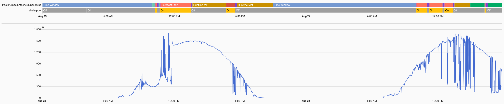
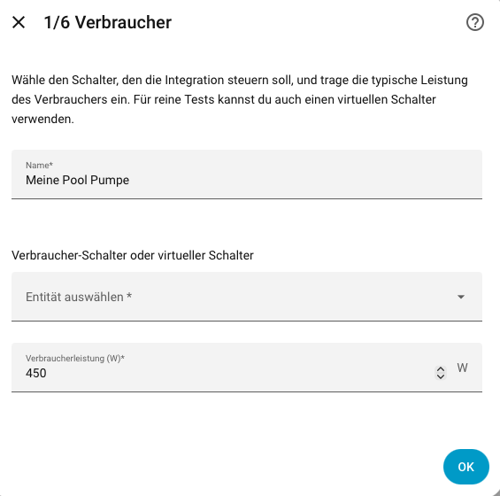
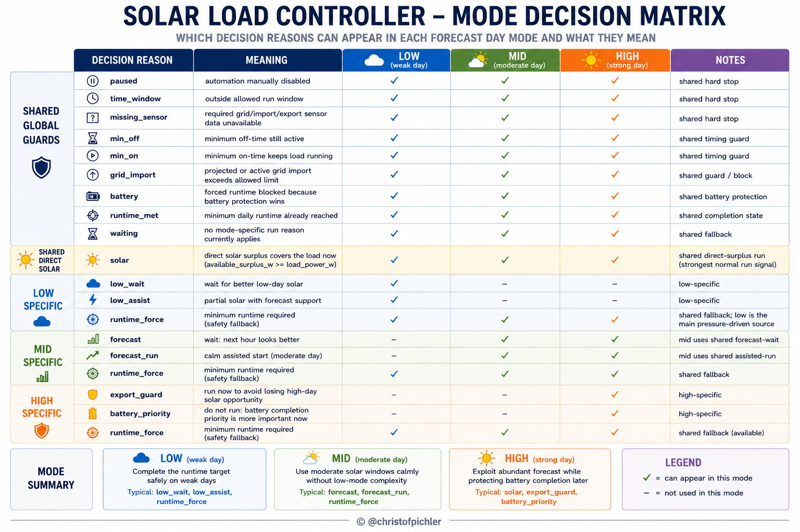
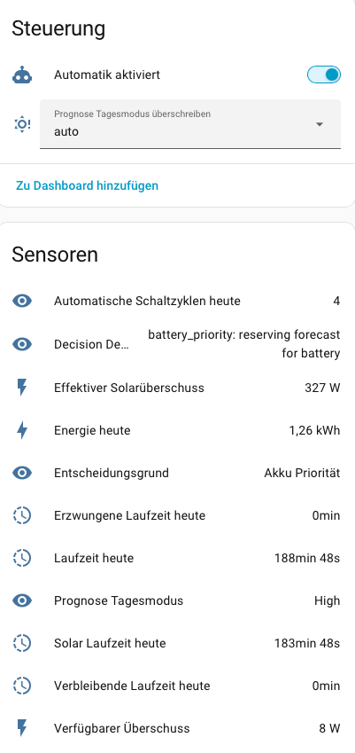

# Solar Load Controller

[](https://github.com/hacs/default)
[](https://github.com/christofpichler/ha-solar-load-controller/releases)
[](https://github.com/christofpichler/ha-solar-load-controller/actions/workflows/tests.yml)


Runs a switchable load when solar energy is actually useful — and still
guarantees it runs long enough on days when it is not.

It combines live grid import and export, a PV forecast, optional battery data
and a daily runtime target into one decision, re-evaluated every minute. No
YAML, no hardcoded values, no assumptions about your hardware.

## Is this for you?

You will get something out of this if:

- Your PV array is larger than your inverter can output — a 1.8 kWp setup
  behind an 800 W limit, for example.
- You have a load worth scheduling: a pool pump, a water heater, a
  dehumidifier, a car charger, anything behind a `switch` or `input_boolean`.
- That load needs a **minimum runtime per day** whether the sun cooperates or
  not.
- A simple "run when export > X" automation keeps switching it on and off, or
  pulls from the grid when the household is already using the inverter output.

If your inverter can always cover both the house and the load, a basic
threshold automation will do and you do not need this.

## The problem it solves

On a strong day the battery fills up and the inverter can no longer use the
full available solar power — energy is clipped and wasted. On a weak day the
load still has to run, and forcing it at the wrong moment means buying
electricity you did not need to.

In between sits the hard part: when the stove is on, the limited inverter
output is already spoken for, and starting a pool pump means importing from the
grid. A threshold automation cannot tell the difference, so it oscillates.

Solar Load Controller makes that call automatically:

- **Weak forecast days** — stays defensive early, waits while the forecast and
  the remaining time still justify it, and forces runtime only when the
  deadline demands it.
- **Strong forecast days** — uses surplus before it is clipped, then becomes
  stricter once the daily target is met so the battery can still finish
  charging.
- **House loads take priority** — when the household consumes the available
  inverter output, the controlled load stops.
- **Spikes are filtered** — a two-second smart meter or inverter reaction does
  not switch anything.
- **Manual control always wins** — pause the automation and operate the load by
  hand.



Two days in August. Top row the decision reason, below it the pump, underneath
the PV output. The runs sit on the solar peak instead of next to it, in a few
long blocks rather than a dozen short ones.

## Installation

Solar Load Controller is in the **HACS default store** — no custom repository
needed.

[](https://my.home-assistant.io/redirect/hacs_repository/?owner=christofpichler&repository=ha-solar-load-controller&category=integration)

1. Open **HACS**, search for `Solar Load Controller`, install it.
2. Restart Home Assistant.
3. Add it under **Settings → Devices & services → Add integration**.

Setup runs entirely through the config flow — six steps, no YAML, in English
or German.



## What you need

**Required**

| Input | Notes |
|---|---|
| Load switch | a `switch` or `input_boolean` entity |
| Load power | in watts |
| Runtime window | earliest start, latest finish, minimum daily runtime |
| Minimum on / off time | protects the appliance from short cycling |
| Grid import and export sensors | positive watt values |
| PV array size | in kWp |
| PV forecast for today | in kWh |
| High day threshold | in kWh/kWp |

**Optional, but the controller gets noticeably better with them**

| Input | What it enables |
|---|---|
| Current PV power | present-tense checks instead of forecast-only decisions |
| Inverter AC limit | recognising clipped power that cannot serve an AC load |
| Forecast next hour / remaining today | waiting for a better window |
| Battery SoC, power, sign, capacity, mode | battery-aware priority and surplus |
| Debug sensor and decision log | full traceability of every decision |

### PV forecast

Developed and tested against
[BJReplay/ha-solcast-solar](https://github.com/BJReplay/ha-solcast-solar).

Any forecast integration works if it provides stable numeric sensors for
forecast today in kWh, next hour, and remaining today.

## How it decides



The day is classified once each morning after 06:00 from the forecast, in
kWh/kWp, into one of three classes. A manual override select (`auto`, `low`,
`mid`, `high`) is available for testing.

### High mode

For strong forecast days. Prefers direct solar and export-aware runtime
decisions, then becomes stricter after the minimum runtime is met so remaining
forecast can still cover battery charging, household reserve and the late-day
battery-priority buffer.

The daily runtime target is a floor, not a cap: on a strong day the load
deliberately keeps running on surplus that would otherwise be exported or
clipped.

### Mid mode

The calm middle band. It can wait for a clearly better next-hour window, allow
a simple assisted start, and otherwise falls through to the shared completion
logic without low-mode pressure or hold hysteresis. Assisted starts use
AC-usable current solar, including solar routed into battery charging, but
never active battery discharge.

### Low mode

For weak days. Stays defensive early, prefers waiting while forecast and
remaining slack still justify it, and becomes progressively more willing to
assist or force runtime later in the day. Separate helpers handle runtime
pressure, forecast-aware waiting, assisted starts on partial solar, and
deadline-driven forcing.

For the decision tree, helper functions and tuning constants behind each mode,
see [docs/decision-model.md](docs/decision-model.md).

## Entities

Entity IDs include the configured integration name. Display names follow your
Home Assistant language — shown here in German; technical state values stay
English so automations built on them do not break.



One strong day: four automatic starts, 188 minutes of runtime of which 183 came
from solar, and nothing forced from the grid.

| Entity | Purpose |
|---|---|
| `switch.<name>_automation_paused` | hand control back to yourself |
| `select.<name>_forecast_day_mode_override` | force a day class for testing |
| `sensor.<name>_decision_reason` | why the load is on or off right now |
| `sensor.<name>_runtime_today` | runtime so far |
| `sensor.<name>_runtime_remaining_today` | still to go against the target |
| `sensor.<name>_solar_runtime_today` | of which was covered by solar |
| `sensor.<name>_forced_runtime_today` | of which had to be forced |
| `sensor.<name>_energy_today` | estimated consumption |
| `sensor.<name>_switch_cycles_today` | automatic starts today |
| `sensor.<name>_available_surplus` | grid-free surplus |
| `sensor.<name>_effective_solar_surplus` | including AC-usable battery charge |
| `sensor.<name>_forecast_day_mode` | today's class |
| `sensor.<name>_decision_debug` | full decision trace, when debug is enabled |

### Decision states

`sensor.<name>_decision_reason` reports one of:

`solar` · `export_guard` · `forecast_run` · `forecast` · `low_assist` ·
`low_wait` · `grid_import` · `battery` · `battery_priority` · `runtime_force` ·
`runtime_met` · `paused` · `waiting` · `missing_sensor` · `min_on` · `min_off` ·
`time_window`

## Debug log

With debug enabled, every decision change is written to:

```text
/config/solar_load_controller_decisions.jsonl
```

One JSON object per line, starting with the local timestamp, containing the
final decision, every decision input, the relevant settings and the raw Home
Assistant states of the configured entities. That is enough to reconstruct any
switching behaviour after the fact.

Pruning starts once the file reaches 2000 entries; from then on it keeps at
most 2000 and drops anything older than 7 days. The path is also exposed on the
debug sensor as `debug_log.path`.

## Support

Report bugs, unexpected switching or setup problems here:

[GitHub Issues](https://github.com/christofpichler/ha-solar-load-controller/issues)

With debug enabled, include the relevant lines from
`/config/solar_load_controller_decisions.jsonl` — they usually contain the
whole answer.

## Anonymous usage statistics

Once a day the integration sends a randomly generated installation ID and its
version number, so active installations can be counted — the HACS download
counter cannot distinguish an install from an update or a removal. Nothing else
is transmitted: no host names, entities, devices, measurements, locations or
settings.

Switch it off under **Settings → Devices & Services → Solar Load Controller →
Configure → Advanced**. The integration behaves identically either way.

The collector that receives it is in [`backend_server/`](backend_server/), and
the resulting numbers are public: <https://telemetry.cloudpichler.net>

## Development

```bash
python3 -m venv .venv
.venv/bin/python -m pip install -r requirements-dev.txt
.venv/bin/python -m pytest tests
```

Syntax and translation checks:

```bash
python3 -m py_compile custom_components/solar_load_controller/*.py
python3 -m json.tool custom_components/solar_load_controller/translations/de.json
python3 -m json.tool custom_components/solar_load_controller/translations/en.json
```
