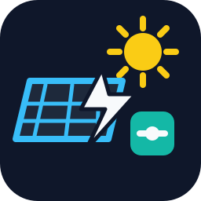

# Solar Load Controller

[](https://github.com/custom-components/hacs)
[](https://github.com/christofpichler/ha-solar-load-controller/actions/workflows/tests.yml)



Solar Load Controller is a Home Assistant custom integration for running a
switchable load when solar energy is actually useful. It combines live grid
import/export values, a PV forecast, optional battery data, and a daily minimum
runtime target.

The first real-world use case is a pool pump controlled from a balcony solar
system with limited inverter output. In that setup the goal is not simply
"run when the sun shines". The controller has to avoid grid import when the
house already needs the available inverter power, ignore short smart meter and
inverter reaction spikes, still guarantee enough daily pump runtime on weak PV
days, and use surplus on strong forecast days before energy is wasted.

The integration is not pool-pump specific. Any switchable larger load can be
controlled if it is represented by a Home Assistant `switch` or `input_boolean`.

## Why This Exists

Balcony solar systems and small PV systems often have more module power than
allowed inverter output. A typical example is a 1.8 kWp PV setup with a 800 W
inverter limit. On a strong day the battery may fill up and the inverter can no
longer use the full available solar power. At the same time, a large household
load like a stove can already consume the limited inverter output, so starting a
pool pump or another large load would pull from the grid.

Solar Load Controller tries to make that decision automatically:

- On weak forecast days it focuses on reaching the configured minimum runtime.
- On strong forecast days it gives PV surplus higher priority so energy is not
  clipped or wasted after the battery is full.
- When house loads consume the available inverter power, it can stop the
  controlled load.
- Short grid-import spikes are filtered so a two-second smart meter or inverter
  reaction delay does not immediately switch the load off.
- Manual operation remains possible by pausing the automation.

## Features

- Full Home Assistant config flow, no YAML required.
- Works with existing Home Assistant entities.
- No hardcoded PV, inverter, battery, or load values.
- Mandatory daily PV forecast classification: `low` or `high`.
- Daily minimum runtime target for low production days.
- High forecast mode to use surplus before PV clipping or wasted export.
- Grid import protection with 15 second spike filtering.
- Configurable runtime window, minimum on time, and minimum off time.
- Optional battery state of charge and signed battery power handling.
- Internal daily runtime, energy, solar runtime, forced runtime, and cycle stats.
- Manual automation pause switch for manual load operation.
- Manual forecast day mode override for diagnostics.
- Optional decision debug sensor and JSONL decision log.
- English entity names and English decision states.
- German and English setup texts.

## Installation With HACS

This repository is intended to be installed as a HACS custom repository.

1. Open HACS in Home Assistant.
2. Open the three-dot menu and select custom repositories.
3. Add this repository URL:
   `https://github.com/christofpichler/ha-solar-load-controller`
4. Select category `Integration`.
5. Install `Solar Load Controller`.
6. Restart Home Assistant.
7. Add the integration from `Settings` -> `Devices & services`.

## Support And Issues

Report bugs, unexpected switching behavior, or setup problems here:

[GitHub Issues](https://github.com/christofpichler/ha-solar-load-controller/issues)

When debug is enabled, include the relevant lines from
`/config/solar_load_controller_decisions.jsonl` in the issue.

## Required Inputs

- Load switch or virtual switch.
- Load power in watts.
- Minimum daily runtime.
- Earliest start time.
- Latest finish time.
- Minimum on time.
- Minimum off time.
- Grid import sensor with positive watt values.
- Grid export sensor with positive watt values.
- PV array size in kWp.
- PV forecast today sensor in kWh.
- High day threshold in kWh/kWp.

## Optional Inputs

- Current PV power sensor.
- Inverter AC limit.
- Forecast next hour sensor.
- Forecast remaining today sensor.
- Battery state of charge sensor.
- Battery power sensor.
- Battery power sign.
- Battery capacity.
- Battery mode.
- Debug sensor and decision log.

## PV Forecast Integration

The current logic is primarily designed and tested with the Solcast PV forecast
integration by BJReplay:

[BJReplay/ha-solcast-solar](https://github.com/BJReplay/ha-solcast-solar)

Solar Load Controller expects forecast entities similar to that integration,
especially:

- forecast today in kWh
- forecast next hour
- forecast remaining today
- current forecast power, optional

Other forecast integrations can also work if they provide compatible Home
Assistant sensor entities with stable numeric states and units.

## Forecast Modes

The integration currently uses two day classes:

- `low`: weak forecast. The controller focuses on reaching the configured
  minimum runtime.
- `high`: strong forecast. The controller tries to use available PV surplus and
  avoid wasting energy when the battery is full or forecast energy is likely to
  exceed remaining battery headroom.

The automatic day class is captured from the forecast after 06:00. A manual
override select is available for testing with `auto`, `low`, and `high`.

## Decision States

Decision states are intentionally short English values:

- `solar`
- `curtailment`
- `forecast_run`
- `forecast`
- `grid_import`
- `battery`
- `runtime_force`
- `runtime_met`
- `paused`
- `waiting`
- `missing_sensor`
- `min_on`
- `min_off`
- `time_window`

## Entities

The entity IDs include the configured integration name. Entity names and state
values are kept in English.

- `switch.<name>_automation_paused`
- `select.<name>_forecast_day_mode_override`
- `sensor.<name>_runtime_today`
- `sensor.<name>_runtime_remaining_today`
- `sensor.<name>_energy_today`
- `sensor.<name>_automatic_switch_cycles_today`
- `sensor.<name>_solar_runtime_today`
- `sensor.<name>_forced_runtime_today`
- `sensor.<name>_available_surplus`
- `sensor.<name>_effective_solar_surplus`
- `sensor.<name>_forecast_day_mode`
- `sensor.<name>_decision_reason`
- `sensor.<name>_decision_debug`, when debug is enabled.

## Debug Log

When debug is enabled, the integration writes a decision log file to the Home
Assistant config folder:

```text
/config/solar_load_controller_decisions.jsonl
```

The file uses JSONL: one JSON object per line. New lines start with the local
timestamp, so a problem time can be found quickly. Each record contains the final
decision, all decision inputs, relevant settings, and raw Home Assistant states
for the configured input entities.

Retention is limited to 7 days or 2000 entries. The exact path is also exposed
on the debug sensor in the `debug_log.path` attribute.

## Development

Create the local development environment:

```bash
python3 -m venv .venv
.venv/bin/python -m pip install -r requirements-dev.txt
```

Run tests:

```bash
.venv/bin/python -m pytest tests
```

Run syntax and translation checks:

```bash
python3 -m py_compile custom_components/solar_load_controller/*.py
python3 -m json.tool custom_components/solar_load_controller/translations/de.json
python3 -m json.tool custom_components/solar_load_controller/translations/en.json
```

## Version

Current release candidate: `1.0.0`.

See [CHANGELOG.md](CHANGELOG.md) for release notes.

## Brand Assets

- Repository icon: `assets/icon.svg`
- Integration icon copy: `custom_components/solar_load_controller/icon.svg`

The icon is intentionally generic: solar generation, energy flow, and a
controlled load. It is not pool-specific.

## Roadmap

- Add a future `mid` forecast mode.
- Add a controlled late-morning forecast recheck.
- Make spike filtering duration configurable.
- Add Home Assistant component tests for config flow, entities, and service
  calls.
- Add adaptive logic based on previous days and forecast accuracy.
