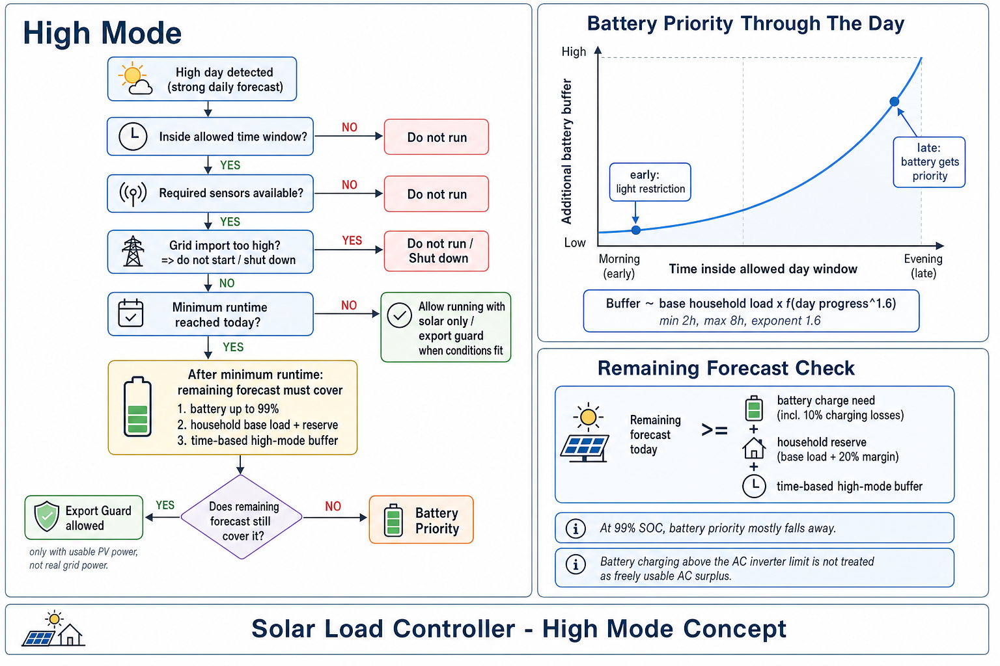
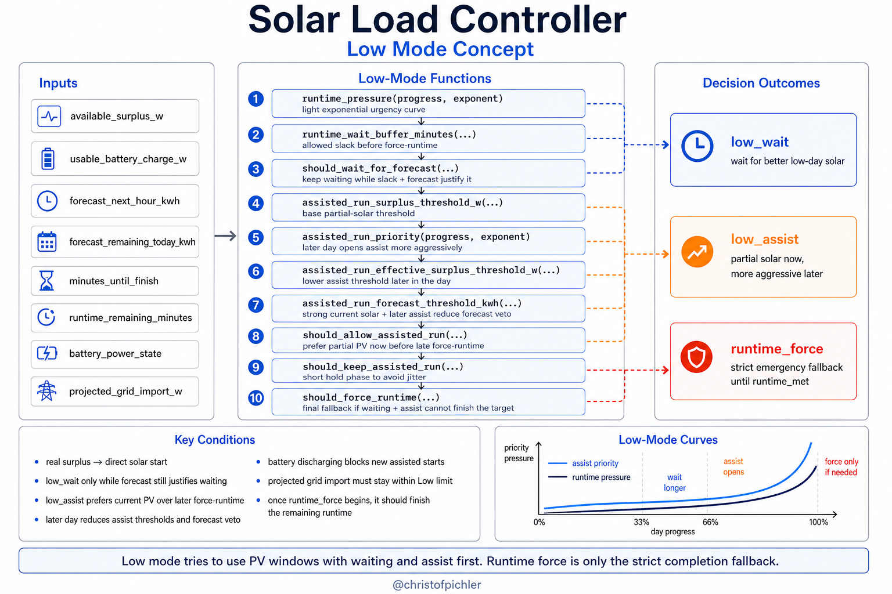
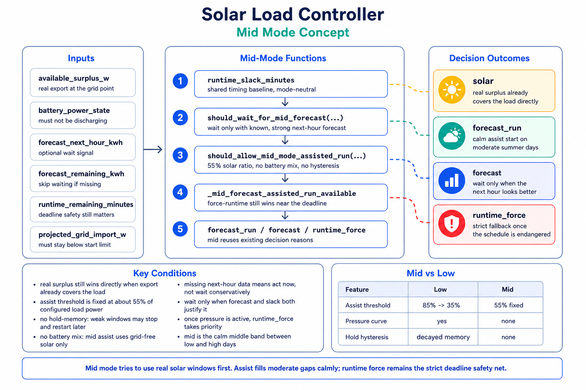

# Decision Model

This document explains the technical decision model behind the Solar Load
Controller integration. It focuses on the internal runtime logic, the current
mode-specific helper functions, and the hardcoded tuning constants that shape
behavior.

## Overview

The controller makes a decision on every relevant state update and reduces that
decision to one short reason such as `solar`, `low_wait`, `export_guard`, or
`battery_priority`.

At a high level, the runtime flow combines:

- current grid import and export
- current battery state
- current and remaining PV forecast
- minimum daily runtime progress
- the configured day window
- mode-specific logic for `low`, `mid`, and `high`

The day class is captured once per day after `06:00` and then held stable for
that day unless the user applies a manual mode override.

Current day classes:

- `low` — below the configured low threshold (default < 2.0 kWh/kWp)
- `mid` — between the low and high thresholds (default 2.0–5.0 kWh/kWp)
- `high` — at or above the configured high threshold (default ≥ 5.0 kWh/kWp)

## Core Calculations

These shared values drive both current modes.

### `available_surplus_w`

Real export surplus that is currently visible at the grid point.

- based on the export sensor
- used as the strongest signal for “this load can run from real AC surplus”

### `effective_solar_surplus_w`

Broader solar support estimate used for runtime decisions.

It combines:

- real export surplus
- battery charging power that is still usable for AC load decisions

It explicitly does **not** blindly count battery charging above the AC inverter
limit as freely usable AC surplus.

Relevant helper:

- `usable_battery_charge_for_ac_surplus(...)` in
  [energy.py](/Users/A200029998/Documents/pool-automation/custom_components/solar_load_controller/energy.py)

### `projected_grid_import_w`

Estimated grid import if the load were started or kept running.

Typical formulas:

- while off:
  `current_grid_import - current_grid_export + load_power`
- while on:
  `current_grid_import`

This is one of the main guards against false restarts.

### `battery_charge_required_kwh`

Energy still needed to charge the battery from current SOC toward the active
target, including charging losses.

Relevant helper:

- `required_input_energy(...)` in
  [energy.py](/Users/A200029998/Documents/pool-automation/custom_components/solar_load_controller/energy.py)

## Day Class Capture

The controller distinguishes between:

- live forecast values that continue updating during the day
- a captured day class that stabilizes overall mode behavior

After `06:00`, the integration captures the day class from:

- `forecast_today_kwh`
- `pv_size_kwp`
- configured low-mode threshold in `kWh/kWp`  (`forecast_low_threshold_kwh_per_kwp`)
- configured high-mode threshold in `kWh/kWp` (`forecast_high_threshold_kwh_per_kwp`)

That means:

- `forecast_remaining_today_kwh` and `forecast_next_hour_kwh` remain live
- `forecast_day_class` remains stable for the day

This prevents mode flapping when forecast services revise totals during the
day.

## Decision Reasons

The current short decision reasons are:

- `solar`
- `export_guard`
- `forecast_run`
- `forecast`
- `low_assist`
- `low_wait`
- `grid_import`
- `battery`
- `battery_priority`
- `runtime_force`
- `runtime_met`
- `paused`
- `waiting`
- `missing_sensor`
- `min_on`
- `min_off`
- `time_window`

## High Mode

High mode is designed for strong forecast days. It is more willing to use
available solar support early, but becomes stricter later in the day after the
minimum runtime is already satisfied.

### Main behavior

Before minimum runtime is met:

- can run from real surplus
- can run from broader effective solar support when the grid situation is clean

After minimum runtime is met:

- battery completion becomes more important
- expected household consumption is reserved
- a late-day time-priority buffer is added
- restart decisions become stricter

### Key helpers

In [energy.py](/Users/A200029998/Documents/pool-automation/custom_components/solar_load_controller/energy.py):

- `household_energy_reserve_kwh(...)`
- `time_priority_buffer_kwh(...)`

In [high_mode.py](/Users/A200029998/Documents/pool-automation/custom_components/solar_load_controller/high_mode.py):

- `allow_post_runtime_export_guard_restart(...)`

### High-mode tuning constants

These are currently hardcoded in
[coordinator.py](/Users/A200029998/Documents/pool-automation/custom_components/solar_load_controller/coordinator.py).

#### Shared high-mode forecast and restart behavior

- `HIGH_FORECAST_CURTAILMENT_HEADROOM_RATIO = 0.8`
  - minimum fraction of post-runtime battery need that still counts as “enough
    remaining forecast” for a strong day
- `HIGH_FORECAST_NO_GRID_TOLERANCE_W = 25`
  - tolerance for “no meaningful grid import” checks in high mode
- `BATTERY_CHARGING_EFFICIENCY = 0.9`
  - used when converting battery headroom into required PV input energy
- `HIGH_FORECAST_POST_RUNTIME_BATTERY_TARGET_SOC = 99`
  - internal battery-complete target for post-runtime high-mode logic
- `HIGH_FORECAST_POST_RUNTIME_BATTERY_HEADROOM_KWH = 0.05`
  - small top-end headroom under which the battery is treated as effectively at
    target
- `HIGH_FORECAST_POST_RUNTIME_RESTART_SURPLUS_MARGIN_W = 75`
  - extra effective-surplus margin required for post-runtime restart when no
    real export is available
- `HIGH_FORECAST_POST_RUNTIME_NEXT_HOUR_RATIO = 1.5`
  - multiplier that defines how strong the next-hour forecast must be for a
    restart based on effective solar support

#### Late-day battery-priority curve

- `HIGH_FORECAST_POST_RUNTIME_PRIORITY_BUFFER_MIN_HOURS = 2.0`
  - minimum reserve window, expressed as hours of effective household load
- `HIGH_FORECAST_POST_RUNTIME_PRIORITY_BUFFER_MAX_HOURS = 8.0`
  - maximum reserve window late in the day
- `HIGH_FORECAST_POST_RUNTIME_PRIORITY_BUFFER_EXPONENT = 1.6`
  - shapes the late-day rise of battery priority; values above `1.0` make it
    more conservative later than earlier

### High-mode config inputs

These are user-configurable and directly feed the high-mode model:

- `forecast_high_threshold_kwh_per_kwp`
- `high_mode_base_household_load_w`
- `high_mode_household_reserve_margin_percent`

## Low Mode

Low mode is designed for weaker forecast days. Its job is not to maximize
surplus usage, but to reach the minimum daily runtime with as little unnecessary
grid and battery stress as possible.

### Main behavior

Low mode currently has three main phases:

1. **Wait defensively**
   - if enough time slack remains and the short-term forecast still justifies
     waiting, it emits `low_wait`
2. **Allow controlled assisted starts**
   - if there is partial current solar support, a clean projected grid state,
     and enough short-term forecast confidence, it may emit `low_assist`
3. **Force runtime when the deadline gets too close**
   - once waiting is no longer responsible, it falls through toward
     `runtime_force`

Once `runtime_force` begins, the controller latches that mode until the minimum
runtime target is actually reached or automation is paused. It also schedules
an exact completion callback at the projected runtime-complete timestamp, so
the load can stop at the target instead of waiting for a later periodic update.

### Key helpers

In [low_mode.py](/Users/A200029998/Documents/pool-automation/custom_components/solar_load_controller/low_mode.py):

- `runtime_pressure(...)`
- `runtime_wait_buffer_minutes(...)`
- `should_force_runtime(...)`
- `forecast_wait_threshold_kwh(...)`
- `should_wait_for_forecast(...)`
- `assisted_run_surplus_threshold_w(...)`
- `should_allow_assisted_run(...)`
- `should_keep_assisted_run(...)`

The assisted-run hold path is intentionally more tolerant than the assisted-run
start path:

- start decisions use the current raw effective solar support
- hold decisions use a short decaying remembered support value
- hold decisions apply lower surplus and forecast thresholds than fresh starts
- hold decisions still stop immediately if raw current support collapses too far

### Low-mode tuning constants

These are currently hardcoded in
[coordinator.py](/Users/A200029998/Documents/pool-automation/custom_components/solar_load_controller/coordinator.py).

#### Runtime pressure curve

- `LOW_FORECAST_RUNTIME_BUFFER_MIN_RATIO = 0.15`
  - early-day tolerance for remaining slack, expressed as a fraction of minimum
    daily runtime
- `LOW_FORECAST_RUNTIME_BUFFER_MAX_RATIO = 0.75`
  - late-day tolerance for remaining slack before low mode should stop waiting
- `LOW_FORECAST_RUNTIME_BUFFER_EXPONENT = 1.6`
  - shapes how fast runtime pressure ramps up over the day

Together these constants answer:

- how much slack low mode may still tolerate
- and how early `runtime_force` should begin to take over

#### Forecast-wait thresholds

- `LOW_FORECAST_WAIT_THRESHOLD_MIN_MULTIPLIER = 1.0`
  - early-day multiplier for the next-hour forecast threshold
- `LOW_FORECAST_WAIT_THRESHOLD_MAX_MULTIPLIER = 1.75`
  - later-day multiplier that makes waiting harder to justify

Together they shape how optimistic low mode still is about waiting for a better
solar window.

#### Assisted-run thresholds

- `LOW_FORECAST_ASSISTED_SURPLUS_EARLY_RATIO = 0.85`
  - early in the day, low assist requires almost the full load power to be
    backed by current effective solar support
- `LOW_FORECAST_ASSISTED_SURPLUS_LATE_RATIO = 0.35`
  - later in the day, low assist can start with less current solar support
    because runtime pressure is higher
- `LOW_FORECAST_ASSISTED_HOLD_MINUTES = 3.0`
  - once started via `low_assist`, the controller will hold the run for a short
    additional window before the stricter hold logic may release it
- `LOW_FORECAST_ASSISTED_PRIORITY_EXPONENT = 0.65`
  - shapes a concave low-assist priority curve
  - values below `1.0` make assist rise earlier and then flatten later in the
    day
- `LOW_FORECAST_ASSISTED_SURPLUS_LATE_RELIEF_RATIO = 0.6`
  - controls how far the current-solar assist threshold may relax later in the
    day
- `LOW_FORECAST_ASSISTED_FORECAST_OVERRIDE_RATIO_SPAN = 1.0`
  - defines how much stronger current solar must be than the assist threshold
    before the weak-next-hour forecast hurdle starts fading rapidly
- `LOW_FORECAST_ASSISTED_FORECAST_OVERRIDE_EXPONENT = 2.4`
  - shapes how quickly strong current solar suppresses the next-hour forecast
    veto
- `LOW_FORECAST_ASSISTED_FORECAST_LATE_RELIEF_RATIO = 0.9`
  - controls how much later-day priority can lower the forecast hurdle even
    before current solar becomes very strong

#### Assisted-run hold hysteresis

- `LOW_FORECAST_ASSISTED_HOLD_SURPLUS_RATIO = 0.8`
  - a running assisted load only needs to keep 80% of the normal assisted
    surplus threshold
- `LOW_FORECAST_ASSISTED_HOLD_FORECAST_RATIO = 0.75`
  - a running assisted load only needs to keep 75% of the normal assisted
    forecast threshold
- `LOW_FORECAST_ASSISTED_HOLD_COLLAPSE_RATIO = 0.3`
  - if raw current assist support falls below 30% of the effective assist
    threshold, the assisted run is treated as collapsed and is released
- `LOW_FORECAST_ASSISTED_HOLD_SUPPORT_TIME_CONSTANT_SECONDS = 90.0`
  - the remembered assist support decays over roughly 90 seconds, which helps
    absorb short measurement dips without turning hold logic into a blind timer

Together these constants mean:

- low assist still starts conservatively
- once active, it is allowed to ride through moderate dips
- but it still exits when current support genuinely collapses

### Low-mode config inputs

These user-configurable values most strongly affect low-mode behavior:

- `grid_import_limit_w`
- `min_daily_runtime_minutes`
- `min_runtime_grid_override`
- `min_runtime_battery_override`
- `min_battery_soc`

## Mid Mode

Mid mode covers moderate forecast days — days that are neither tight enough for
low-mode deadline management nor abundant enough for high-mode aggressive surplus
usage. It activates when the day's `forecast_today_kwh / pv_size_kwp` falls
between the two configured thresholds (default: 2.0 – 5.0 kWh/kWp).

### Design principles

Mid mode is intentionally calm and flat:

- no runtime pressure curve — it does not ramp behavior based on time-of-day
- simple hold window — after a `forecast_run` start, mid mode keeps the load
  running for a short fixed period (`MID_FORECAST_ASSISTED_HOLD_MINUTES`)
  even if the solar signal temporarily collapses; grid-import protection still
  cancels immediately; this prevents rapid cycling on installations with noisy
  solar measurements (e.g. microinverters that report 0 W briefly)
- no force cascade — it never escalates to `runtime_force` on its own
- no battery mixing — it only uses effective solar surplus, never active battery
  discharge

`runtime_force` is still available via the shared coordinator path, but mid mode
itself does not activate it. If minimum runtime is not met by end of day and low
mode cannot force it, the coordinator escalates — but mid mode does not push
toward that.

### Main behavior

Mid mode has two main phases:

1. **Wait when short-term solar is too weak**
   - if `forecast_next_hour_kwh` shows enough upcoming energy and the time
     slack is sufficient, it emits `forecast` (`DECISION_FORECAST_WAIT`)
   - if `forecast_next_hour_kwh` is unavailable, mid mode does **not** wait —
     it falls through and acts on current solar immediately (contrast with low
     mode which waits defensively when next-hour data is missing)

2. **Allow a controlled assisted start when current solar is strong enough**
   - if effective solar surplus meets a fixed threshold (55% of load power by
     default) and the projected grid situation is clean, it emits `forecast_run`
     (`DECISION_FORECAST_ASSISTED_RUN`)
   - the threshold is not time-scaled — it is the same at 09:00 as at 15:00

When neither condition applies and there is no real solar surplus, the decision
falls through toward `waiting` or `runtime_force` (if the coordinator's shared
force path activates it).

### Key helpers

In [mid_mode.py](/Users/A200029998/Documents/pool-automation/custom_components/solar_load_controller/mid_mode.py):

- `should_allow_mid_mode_assisted_run(...)`
  - returns `True` when effective solar surplus meets the fixed ratio threshold,
    the projected grid import is below the limit, and the battery is not actively
    discharging
  - blocking conditions: `projected_grid_import_exceeds_limit`, battery
    `discharging`, or `load_power_w <= 0`

- `should_wait_for_mid_forecast(...)`
  - returns `True` when there is still meaningful slack, the next-hour forecast
    is high enough to justify waiting, and forecast data is available
  - returns `False` immediately if `forecast_next_hour_kwh is None` — this is
    the key behavioral difference from low mode

The coordinator guard in `_mid_forecast_assisted_run_available` also enforces
that mid mode never sets `forecast_assisted_run_available = True` when
`_must_force_minimum_runtime` is already active. This prevents mid mode from
suppressing the force-latch that the shared runtime path uses to guarantee the
minimum runtime target is reached.

### Mid-mode tuning constants

These are defined in
[mid_mode.py](/Users/A200029998/Documents/pool-automation/custom_components/solar_load_controller/mid_mode.py).

- `MID_FORECAST_ASSISTED_SURPLUS_RATIO = 0.55`
  - the effective solar surplus must be at least 55% of load power for an
    assisted start; this is a flat ratio with no time-of-day scaling

- `MID_FORECAST_WAIT_NEXT_HOUR_RATIO = 0.75`
  - the next-hour forecast threshold is computed as 75% of load power converted
    to kWh; mid mode waits when the upcoming hour is expected to provide at
    least this much energy

- `MID_FORECAST_ASSISTED_HOLD_MINUTES = 5.0`
  - after the load starts via `forecast_run`, mid mode holds the assisted run
    alive for up to 5 minutes even if the solar signal temporarily drops below
    the surplus threshold; grid-import protection (`projected_grid_import_exceeds_limit`)
    still cancels immediately; prevents rapid cycling from noisy microinverter
    measurements

### Mid-mode config inputs

These user-configurable values control when mid mode is active and how it
interacts with the shared runtime path:

- `forecast_low_threshold_kwh_per_kwp`
  - below this threshold the day is classified as `low`; above it the day is
    `mid` (until the high threshold is reached)
  - default: 2.0 kWh/kWp
  - must be strictly less than `forecast_high_threshold_kwh_per_kwp`; the
    config flow enforces this at save time

- `forecast_high_threshold_kwh_per_kwp`
  - at or above this threshold the day becomes `high`
  - the band between the two thresholds is the mid-mode range

- `min_daily_runtime_minutes`
  - mid mode shares the same minimum runtime target as low mode; the shared
    coordinator path handles force escalation if the deadline approaches

- `min_runtime_battery_override` and `min_runtime_grid_override`
  - these apply identically to mid and low mode when the shared force path
    activates

### Behavioral difference from low mode

The clearest difference between mid and low mode is how each handles a missing
`forecast_next_hour_kwh` sensor:

- **Low mode** waits when next-hour data is missing — the day is tight, so
  waiting is the safer default
- **Mid mode** does not wait when next-hour data is missing — the day has enough
  forecast headroom that waiting on absent data serves no purpose; it acts on
  whatever current solar is available instead

## Debugging and Analysis

For practical debugging there are two main surfaces:

- `sensor.<name>_decision_reason`
  - compact reason plus contextual attributes
- `sensor.<name>_decision_debug`
  - full structured decision tree when debug is enabled

The JSONL decision log records:

- the final decision
- all decision inputs
- relevant settings
- raw Home Assistant states
- manual load changes as separate events

Manual load changes are logged with:

- `event.type = "load_change"`
- `event.source = "manual"`
- `event.action = "turn_on"` or `turn_off`

That makes it possible to exclude manual tests from later behavior analysis.
